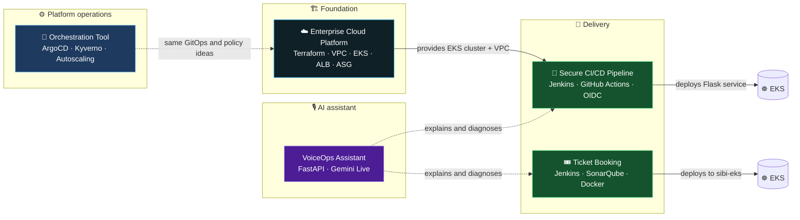
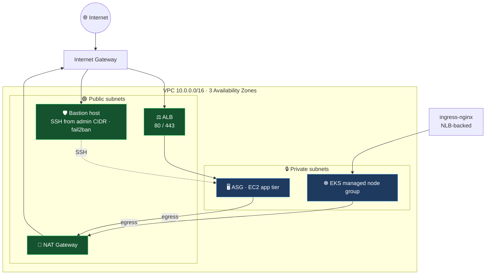
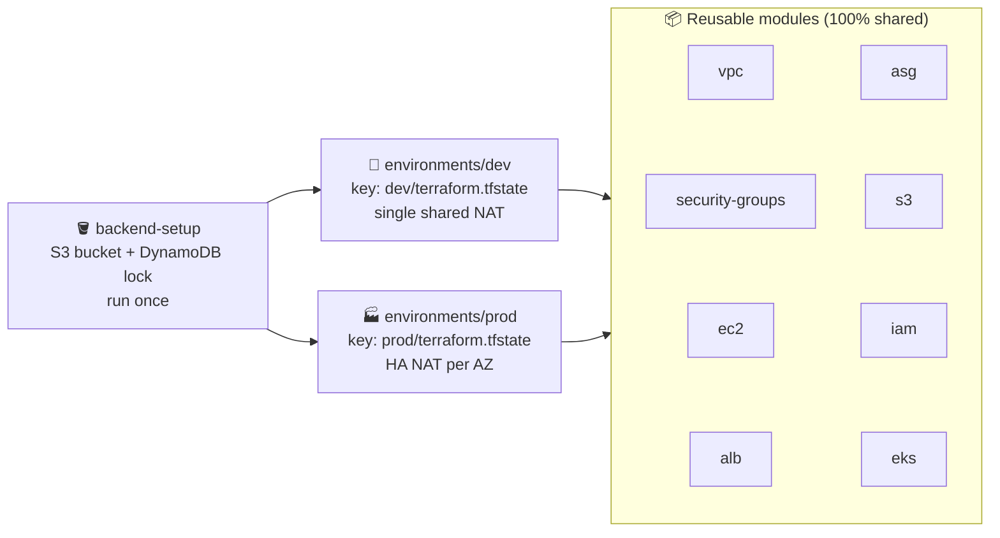
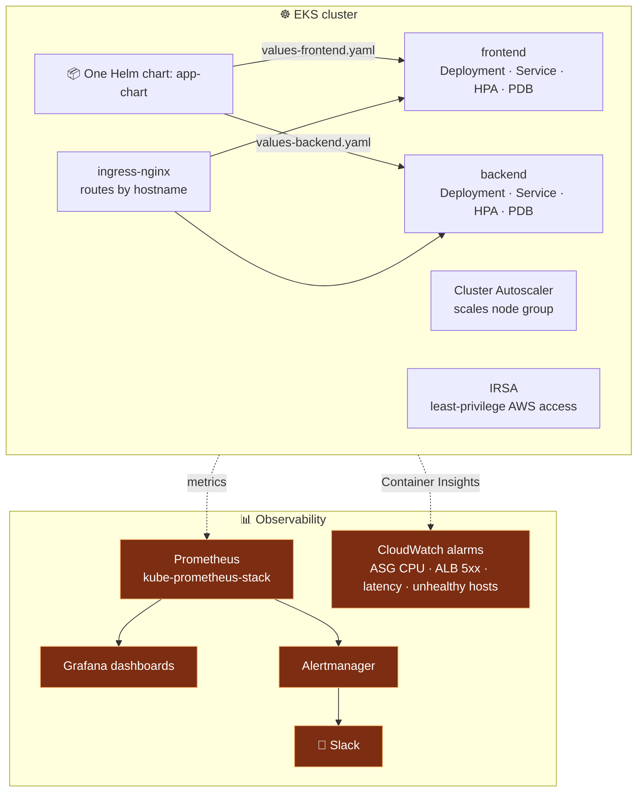
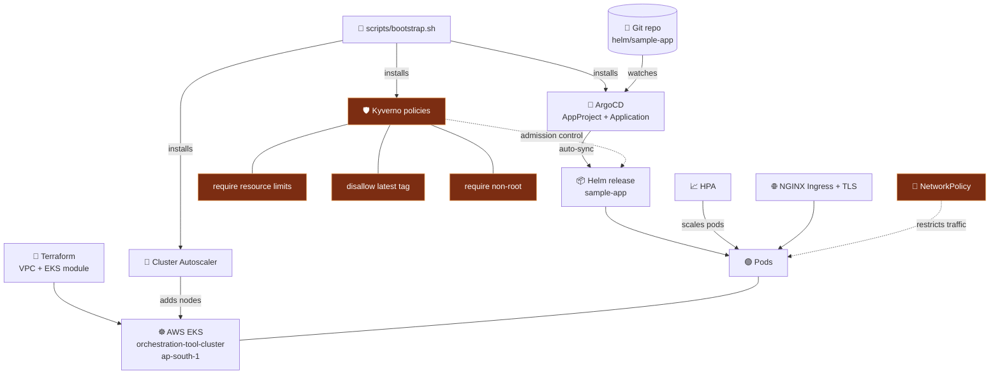
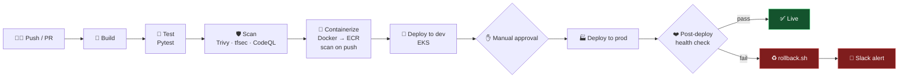
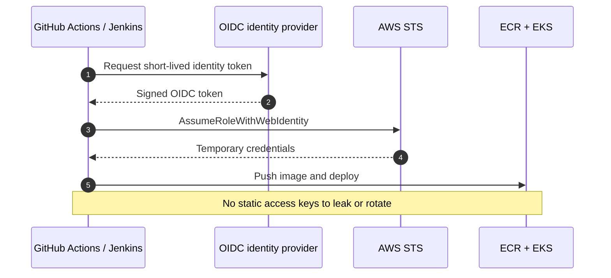
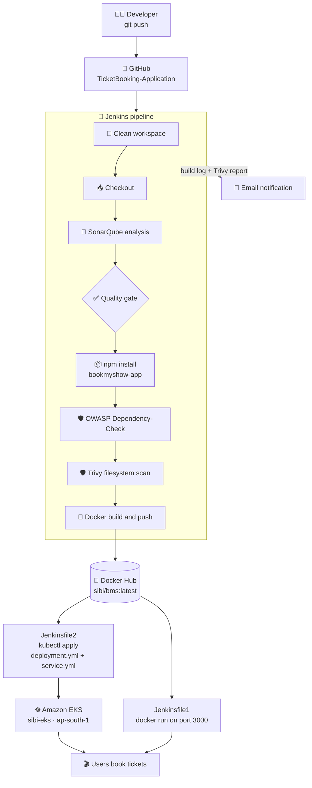
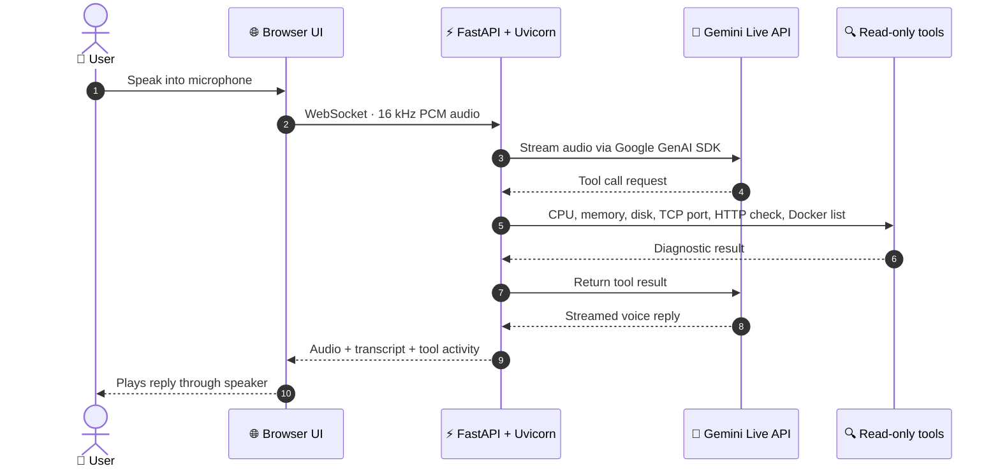
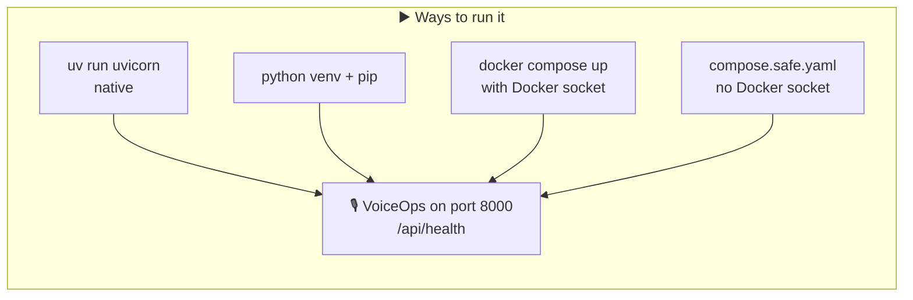

 

**By [Sibi Karthik](https://github.com/cibi0zh)** · [LinkedIn](https://www.linkedin.com/in/sibi-karthik-219b1837a/) · [ORCID](https://orcid.org/0009-0003-0007-1968)

---

## 🧭 Jump to a project

| # | Project | Focus | Stack |
|:-:|---|---|---|
| 0 | [🗺️ The big picture](#big-picture) | How everything connects | All of the below |
| 1 | [☁️ Enterprise Cloud Platform](#platform) | Multi-AZ AWS + EKS with modular Terraform | `Terraform` `EKS` `ALB` `ASG` `Helm` |
| 2 | [🤖 Orchestration & GitOps](#gitops) | Cluster automation, ArgoCD, policy as code | `ArgoCD` `Kyverno` `HPA` |
| 3 | [🔁 Secure CI/CD Pipeline](#cicd) | Keyless, scanned, auto-rollback deploys | `Jenkins` `GH Actions` `OIDC` `Trivy` |
| 4 | [🎟️ Ticket Booking DevSecOps](#ticketbooking) | App delivered to EKS via Jenkins | `SonarQube` `OWASP` `Docker` `EKS` |
| 5 | [🎙️ VoiceOps Assistant](#voiceops) | Real-time AI voice DevOps helper | `FastAPI` `WebSocket` `Gemini Live` |

---

## 🗺️ 0. The big picture

Five repos, one story: **build the platform → run it declaratively → ship code to it safely → get help operating it.**

<b>📌 What each layer teaches</b>

| Layer | Skill demonstrated |
|---|---|
| Foundation | Infrastructure as Code, networking, remote state, HA design |
| Operations | GitOps, policy as code, autoscaling |
| Delivery | Shift-left security, keyless auth, automated rollback |
| AI assistant | Real-time streaming, safe read-only tooling |

---

## ☁️ 1. Enterprise Cloud Infrastructure & Kubernetes Platform

  

A production-style, multi-AZ AWS environment that runs the same app **two ways**: on an EC2 Auto Scaling Group and on EKS.

### 🌐 Network layout

### 🧱 Terraform layout and remote state

### 📈 Kubernetes layer and observability

**Highlights**
- 🔐 Defense in depth on SSH: security groups + fail2ban + a single bastion
- 🛡️ IMDSv2 enforced, S3 encrypted and private, IRSA instead of broad node permissions
- 🐍 Boto3 and Bash automation with Cron, cutting environment setup to about 15 minutes
- ✅ CI runs `terraform validate`, tfsec and `helm lint`

**Repo:** [Enterprise-Cloud-Infrastructure-Kubernetes-Platform-AWS-](https://github.com/cibi0zh/Enterprise-Cloud-Infrastructure-Kubernetes-Platform-AWS-)

---

## 🤖 2. Orchestration Tool: Kubernetes Automation & GitOps

  

Provisions an EKS cluster with Terraform, delivers workloads with **Helm + ArgoCD**, and enforces policy with **Kyverno**.

**Highlights**
- 🔄 Git is the source of truth: ArgoCD reconciles the cluster to match the repo
- 🛡️ Bad deployments are rejected at admission time, before they run
- 📈 Two layers of autoscaling: pods (HPA) and nodes (Cluster Autoscaler)

**Repo:** [orchestration-tool-Automation](https://github.com/cibi0zh/orchestration-tool-Automation)

---

## 🔁 3. Secure CI/CD & GitOps Automation Pipeline

  

Jenkins and GitHub Actions run the **same five stages** to ship a Flask health-check service to EKS, with no long-lived AWS keys.

### 🔑 Keyless AWS authentication (OIDC)

**Highlights**
- 🚫 Trivy and tfsec run as **required checks** that block merges on critical findings
- 🧱 Terraform (`oidc/`, `ecr/`) creates the roles and the registry
- 🧭 Separate workflows: `ci-cd.yml`, `terraform-plan.yml`, `codeql.yml`

**Repo:** [CI-CD-PIPELINE-WITH-FAILURE-ALERTS](https://github.com/cibi0zh/CI-CD-PIPELINE-WITH-FAILURE-ALERTS) · 🌐 [Live page](https://ci-cd-pipeline-with-failure-alerts.vercel.app)

---

## 🎟️ 4. Ticket Booking (BookMyShow clone): DevSecOps on EKS

  

A Node.js movie booking app delivered by a Jenkins pipeline that scans the code, builds a Docker image, and deploys either to a container (`Jenkinsfile1`) or to **Amazon EKS** (`Jenkinsfile2`).

| File | Role |
|---|---|
| `bookmyshow-app/` | Node.js app and its Dockerfile |
| `Jenkinsfile1` | Pipeline without Kubernetes (Docker container deploy) |
| `Jenkinsfile2` | Pipeline with the EKS deploy stage |
| `deployment.yml` · `service.yml` | Kubernetes manifests |
| `BMS-Document.txt` | EKS cluster and node group notes |

**Repo:** [TicketBooking-Application](https://github.com/cibi0zh/TicketBooking-Application)

---

## 🎙️ 5. Sibi VoiceOps Assistant: real-time AI voice for DevOps

  

The browser streams microphone audio over a WebSocket to a **FastAPI** backend, which keeps a **Gemini Live** session open and streams the voice reply back. It can only run a small set of **read-only** diagnostics.

**Highlights**
- 🔒 No arbitrary shell execution and no destructive actions, by design
- 🐳 `compose.safe.yaml` runs without mounting the Docker socket
- 📝 UI shows live transcripts and which tool ran

**Repo:** [AI-voice-capability-check](https://github.com/cibi0zh/AI-voice-capability-check)

---

## 🧰 Technology matrix

| Technology | ☁️ Platform | 🤖 GitOps | 🔁 CI/CD | 🎟️ Ticket | 🎙️ Voice |
|---|:-:|:-:|:-:|:-:|:-:|
| Terraform | ✅ | ✅ | ✅ | | |
| AWS EKS | ✅ | ✅ | ✅ | ✅ | |
| Helm | ✅ | ✅ | | | |
| ArgoCD / Kyverno | | ✅ | | | |
| Jenkins | | | ✅ | ✅ | |
| GitHub Actions | ✅ | | ✅ | | |
| Trivy / tfsec | ✅ | | ✅ | ✅ | |
| SonarQube / OWASP | | | | ✅ | |
| Prometheus / Grafana | ✅ | | | | |
| Docker | | | ✅ | ✅ | ✅ |
| Python | ✅ | | ✅ | | ✅ |
| Node.js | | | | ✅ | |

---

**⭐ If this helped you, star the repos, and feel free to connect on [LinkedIn](https://www.linkedin.com/in/sibi-karthik-219b1837a/)**

